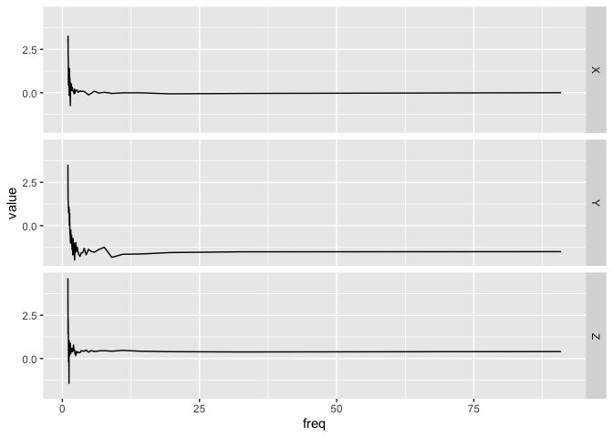

<!-- README.md is generated from README.Rmd. Please edit that file -->

# bis620.2022

<!-- badges: start -->

[](https://github.com/Scott-Zuo/bis620.2022/actions/workflows/R-CMD-check.yaml)
[](https://app.codecov.io/gh/Scott-Zuo/bis620.2022?branch=main)
[](https://github.com/Scott-Zuo/bis620.2022/actions/workflows/lint.yaml)
[](https://github.com/Scott-Zuo/bis620.2022/actions/workflows/test-coverage.yaml)
<!-- badges: end -->

The goal of bis620.2022 is to generate accelerometry plot for dataset
with time and 3-dimensional coordinates. It also includes a
functionality of generating spectral signature plots. The dataset
`ukb_accel` included in the package is from UKBiobank for examples and
practice use.

## Installation

You can install the development version of bis620.2022 from
[GitHub](https://github.com/) with: <br> `install.packages("devtools")`
<br> `devtools::install_github("Scott-Zuo/bis620.2022")`

## Example

``` r
library(bis620.2022)
## basic example code
data(ukb_accel)
ukb_accel[1:100, ] |>
      spectral_signature(take_log = TRUE) |>
      accel_plot()
```


